<div align="center">


# Giovanni de Luca Gomieri


<p>
  <a href="https://github.com/GiGomieri05"></a>
  <a href="https://facens.br"></a>
  <a href="https://rdbfutura.com.br"></a>
</p>

<code>ENGINEERING</code> · <code>ROCKETRY</code> · <code>EDTECH</code> · <code>ROBOTICS</code> · <code>ASTRONOMY</code>

</div>

---

## `> whoami`

```yaml
name: Giovanni de Luca Gomieri
role:
  - Computer Engineering Student
  - Founder & Developer @ RDB Futura
  - Technology Teacher
location: Sorocaba, SP, Brazil
university: FACENS
focus:
  - software engineering
  - competitive programming
  - STEAM education
  - embedded systems & robotics
  - astronomy & rocketry
mission: "Turn technical knowledge into practical, visible results."
```

I build software, educational experiences and physical-digital products at the intersection of **engineering, technology and learning**.

Today, my main project is **RDB Futura**, an EdTech initiative focused on hands-on STEAM experiences, gamification and practical learning for students and teachers.

---

## `> mission_control --rocketry`

<table>
<tr>
<td width="50%" valign="top">

### 🚀 National Rocketry Record

**488.5 m**

MOBFOG / Jornada Brasileira de Foguetes

- National record
- 46ª Jornada Brasileira de Foguetes
- Copa Paulista Champion
- 2× AMERIFOG Champion
- 26 awards and counting

</td>
<td width="50%" valign="top">

### 🛰️ Current trajectory

- Building **RDB Futura**
- Studying **Computer Engineering @ FACENS**
- Training for **competitive programming contests**
- Teaching technology to students
- Exploring **robotics, embedded systems and astronomy**

</td>
</tr>
</table>

---

## `> stack --active`

### Languages

<p>
  
  
  
  
  
  
  
  
</p>

### Frameworks, platforms & tools

<p>
  
  
  
  
  
  
  
  
  
</p>

---

## `> telemetry --github`

<div align="center">
  
  
</div>

> These cards are generated by GitHub Actions and stored in this repository, so the profile does not depend on a public stats endpoint every time it loads.

---

## `> systems --building`

```text
[RDB FUTURA]
    │
    ├── STEAM hands-on missions
    ├── gamified learning platform
    ├── BNCC-aligned learning evidence
    ├── physical kits + digital experience
    └── astronomy as a gateway to science & engineering
```

I am especially interested in projects where **software meets the physical world**: robotics, IoT, embedded systems, educational hardware and systems that make complex ideas easier to understand by building something real.

---

## `> connect`

<div align="center">

[](https://linkedin.com/in/giovannigomieri)
[](mailto:contato@rdbfutura.com.br)
[](https://rdbfutura.com.br)

<br />


<br /><br />

<sub>“A ciência prática produz resultados concretos e visíveis.”</sub>

</div>
